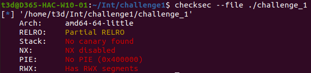

# Initial setup and enumeration
After downloading the challenge_1 executable and modifying the file permissions, I ran the program to see what it does.

The program offers three options:
•	Creating a note.
•	Reading all the created notes.
•	Exiting the program.
 
I proceeded to check for low-hanging fruit; Format string bugs, Buffer Overflows (BoF), etc.
